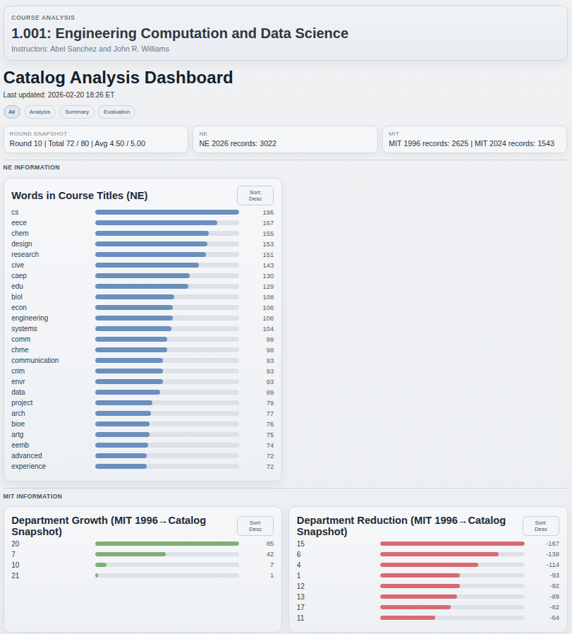

# catalog

Problem set objective: Gain hands-on experience in data collection, storage, processing, and consumption. Gain experience in analytics and visualization by working with a public university course catalog data.

## Result Dashboard Preview

## Overview

- This repository follows a single-round collaboration model.
- Roles are Planner, Reviewer, Builder, and Grader.
- Detailed process and role definitions are documented in separate reference files.

## Documentation Index

- Project plan: `references/process/project_plan.md`
- Persona definitions: `references/process/personas.md`
- Statement result checklist: `references/process/statement_result_checklist.md`
- Imported statement reference: `references/google-docs/1kxmwf7e-cLBEEC92QaNUIOeIYWupwPOSnFPnGZrKHfI/document.md`

## External Source Links

- MIT Course Catalog 1996 (PDF index): https://onexi.org/catalog/pdf/index.html

## Documentation Policy

- Do not delete original statement comments in project script files.
- Original comments are part of the project description/reference context and must be preserved.
- Visualization consolidation rule: unless the statement explicitly requires a dedicated visualization artifact/file for a task, visual outputs must be shown only in the integrated dashboard and not emitted as additional standalone visualization files.
- Next-round execution guardrail: do not perform non-statement or discretionary changes without explicit user confirmation first.
- Next-round reporting standard: enrich `README.md`, `16_summary_reflection.txt`, and the dashboard with sufficient, concrete content that clearly communicates core insights and technical edge.

## Data Source Status (Checked on 2026-02-19)

- Harvard (`https://courses.my.harvard.edu`): blocked for this project automation path due to PeopleSoft sign-in/cookie gate; public bulk course extraction is not available from the unauthenticated entry page.
- BU (`https://www.bu.edu/academics/cas/courses/`): reachable and parseable (department links and course entries confirmed).
- Northeastern (`https://catalog.northeastern.edu/course-descriptions/`): reachable and parseable (subject index and courseblock markup confirmed).

## Part I Source Ranking (Checked on 2026-02-19)

1. NE (Northeastern) - 1st choice
- Most consistent HTML structure (`courseblock`, `courseblocktitle`) for code/title extraction.
- Lower parsing noise and lower selector-maintenance risk across 01~08.
- Best fit for stable end-to-end completion of collection, parsing, analysis, and export.

2. BU (Boston University) - 2nd choice
- Publicly reachable and contains rich course data.
- Usable extraction patterns exist, but page content includes more mixed/long narrative text and metadata noise.
- Parsing remains feasible, but cleaning and title extraction are more error-prone than NE.

3. Harvard - 3rd choice
- Current unauthenticated path is gated by PeopleSoft login/cookie requirements.
- Automated public bulk extraction is blocked from the accessible entry points tested.
- Highest implementation risk for this project timeline unless authenticated/manual workflow is introduced.

## Active Run Choice

- Current Part I execution source: `NE (Northeastern)`.

## Extra Files

- `extra_dashboard.py` is an extra extension file for integrated visual review.
- It is outside the original statement scope (`01`~`16`).
- Shareable visualization outputs are consolidated under `results/` at the repository root.

## Final Deliverables

- Main summary: `16_summary_reflection.txt`
- Integrated dashboard: `results/analysis_dashboard.html`
- Core analysis outputs:
- `data/output/10_mit_1996.json`
- `data/output/10_mit_1996_extraction_report.txt`
- `data/output/11_mit_2024.json`
- `data/output/12_course_offerings_delta.csv`
- `data/output/12_course_offerings_summary.txt`
- `data/output/13_title_evolution.csv`
- `data/output/13_title_evolution_summary.txt`
- `data/output/14_new_and_old.txt`
- `data/output/15_curriculum_breadth.txt`
- `data/output/pipeline_snapshot.json`

## How To Run

1. Run the NE pipeline:
`python 09_pipeline.py`

2. Run MIT comparison and dashboard generation:
`python 10_extract_1996.py --force-ocr`
`python 11_extract_2024.py`
`python 12_course_offerings.py`
`python 13_title_evolution.py`
`python 14_new_and_old.py`
`python 15_curriculum_breadth.py`
`python extra_dashboard.py`

3. Open dashboard:
Open `results/analysis_dashboard.html` directly in a browser.
